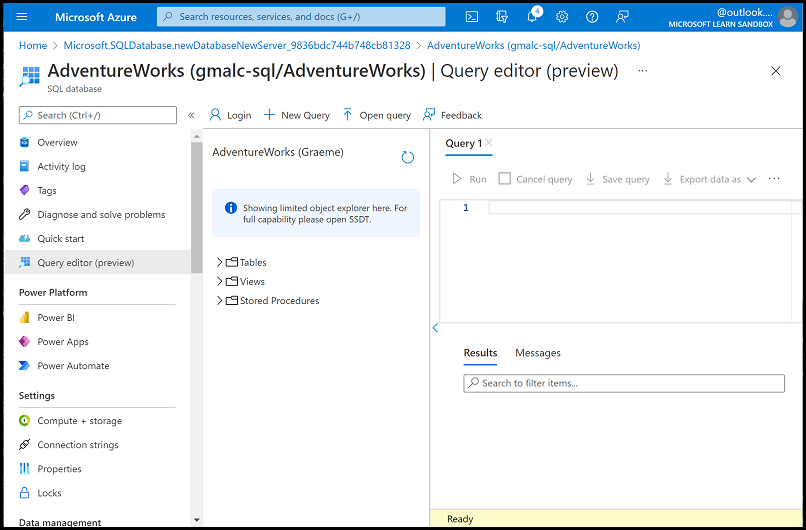
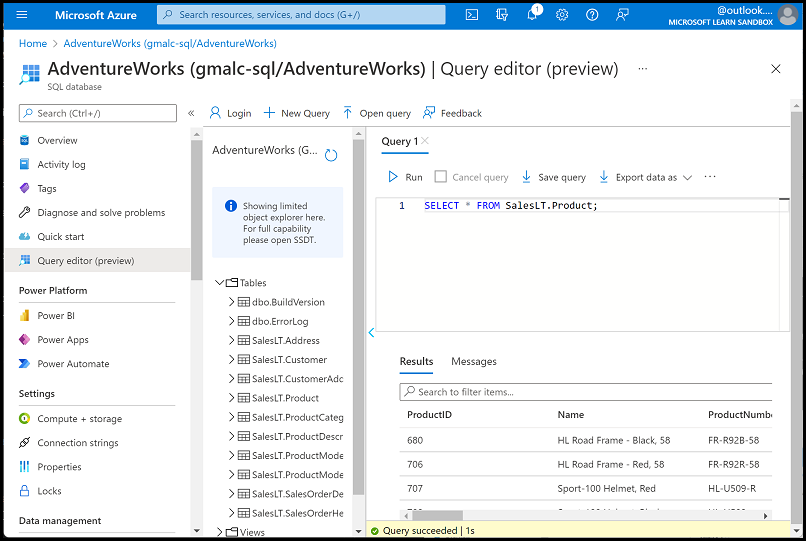
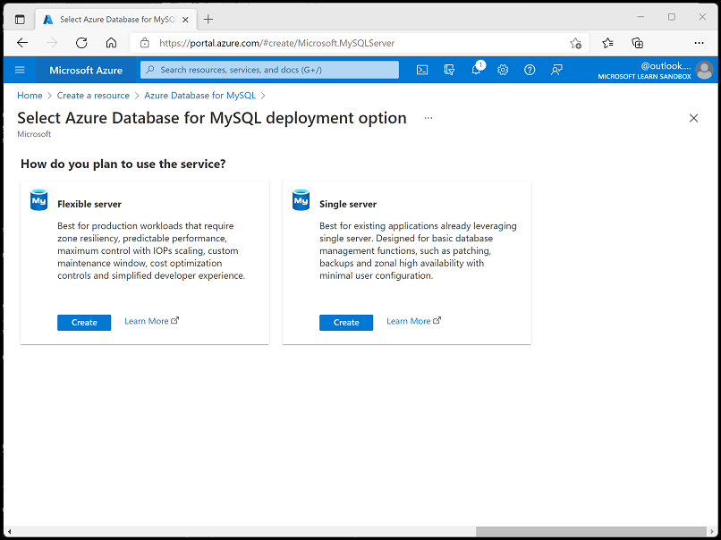
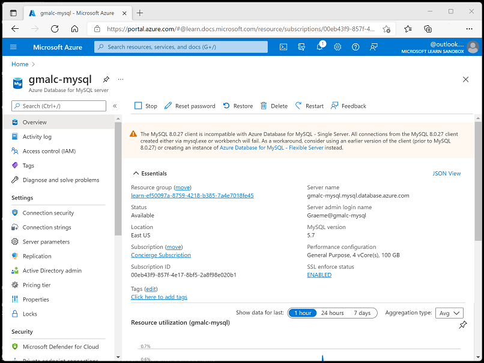

# 01 - Explore Azure SQL Database

In this walkthrough, you'll provision an Azure SQL Database resource in your Azure subscription, and then use SQL to query the tables in a relational database. 

## Exercise 1: Provision Azure relational database services

### Task 1: Provision an Azure SQL Database resource

In this exercise, you'll provision and test an Azure SQL Database resource.

1.  In the Azure portal, select  **＋ Create a resource**  from the upper left-hand corner and search for  _Azure SQL_. Then in the resulting  **Azure SQL**  page, select  **Create**.

    
2.  Review the Azure SQL options that are available, and then in the  **SQL databases**  tile, ensure  **Single database**  is selected and select  **Create**.
    
    

    
3.  Enter the following values on the  **Create SQL Database**  page:
    
    -   **Subscription**: Select your Azure subscription.
    -   **Resource group**: Select **Azure-Researcher-[DeploymentID]** (use existing)
    -   **Database name**:  _AdventureWorks_
    -   **Server**: Select  **Create new**  and create a new server with a unique name in any available location. Use  **SQL authentication**  and specify your name as the server admin login and a suitably complex password (remember the password - you'll need it later!)
    -   **Want to use SQL elastic pool?**:  _No_
    -   **Compute + storage**: Leave unchanged
    -   **Backup storage redundancy**:  _Locally-redundant backup storage_

4.  On the  **Create SQL Database**  page, select  **Next :Networking >**, and on the  **Networking**  page, in the  **Network connectivity**  section, select  **Public endpoint**. Then select  **Yes**  for both options in the  **Firewall rules**  section to allow access to your database server from Azure services and your current client IP address.

    
5.  Select  **Next: Security >**  and set the  **Enable Microsoft Defender for SQL**  option to  **Not now**.
    
6.  Select  **Next: Additional Settings >**  and on the  **Additional settings**  tab, set the  **Use existing data**  option to  **Sample**  (this will create a sample database that you can explore later).
    
7.  Select  **Review + Create**, and then select  **Create**  to create your Azure SQL database.
    
8.  Wait for deployment to complete. Then go to the resource that was deployed, which should look like this:
    
    
    
9.  In the pane on the left side of the page, select  **Query editor (preview)**, and then sign in using the administrator login and password you specified for your server.
    
    _If an error message stating that the client IP address isn't allowed is displayed, select the  **Allowlist IP ...**  link at the end of the message to allow access and try to sign in again (you previously added you own computer's client IP address to the firewall rules, but the query editor may connect from a different address depending on your network configuration.)_
    
    The query editor looks like this:
    
    
    
10.  Expand the  **Tables**  folder to see the tables in the database.
    
11.  In the  **Query 1**  pane, enter the following SQL code:

        SELECT * FROM SalesLT.Product;
    
12.  Select  **▷ Run**  above the query to run it and view the results, which should include all columns for all rows in the  **SalesLT.Product**  table as shown here:
    
    
    
13.  Replace the SELECT statement with the following code, and then select  **▷ Run**  to run the new query and review the results (which includes only the  **ProductID**,  **Name**,  **ListPrice**,  **ProductCategoryID**  columns):

        SELECT ProductID, Name, ListPrice, ProductCategoryID
        FROM SalesLT.Product;

    
14.  Now try the following query, which uses a JOIN to get the category name from the  **SalesLT.ProductCategory**  table:

        SELECT p.ProductID, p.Name AS ProductName,
            c.Name AS Category, p.ListPrice
        FROM SalesLT.Product AS p
        JOIN [SalesLT].[ProductCategory] AS c
            ON p.ProductCategoryID = c.ProductCategoryID;

    
15.  Close the query editor pane, discarding your edits.

## Exercise 2: Provision an Azure Database for PostgreSQL resource

In this exercise, you'll provision an Azure Database for PostgreSQL resource.

1.  In the Azure portal, select  **＋ Create a resource**  from the upper left-hand corner and search for  _Azure Database for PostgreSQL_. Then in the resulting  **Azure Database for PostgreSQL**  page, select  **Create**.
    
2.  Review the Azure Database for PostgreSQL options that are available, and then in the  **Single server**  tile, select  **Create**, and decline the offer to switch to a Flexible server if prompted.
    
    
    
3.  Enter the following values on the  **Create SQL Database**  page:
    
    -   **Subscription**: If you're using a  _sandbox_, select  _Concierge Subscription_. Otherwise, select your Azure subscription.
    -   **Resource group**: Select **Azure-Researcher-[DeploymentID]** (use existing)
    -   **Server name**: Enter a unique name
    -   **Data source**: None
    -   **Location**: Any available location
    -   **Version**: Leave unchanged
    -   **Compute + storage**: Select  **Configure server**, and then change  **vCore**  to two cores, leave the other server settings as they are, and select  **OK**.
    -   **Admin username**: Your name
    -   **Password**  and  **Confirm password**: A suitably complex password
4.  Select  **Review + Create**, and then select  **Create**  to create your Azure PostgreSQL database.
    
5.  Wait for deployment to complete. Then go to the resource that was deployed, which should look like this:
    
    
    
6.  Review the options for managing your Azure Database for PostreSQL resource.

## Exercise 3: Provision an Azure Database for MySQL resource 

In this exercise, you'll provision an Azure Database for MySQL resource.

1.  In the Azure portal, select  **＋ Create a resource**  from the upper left-hand corner and search for  _Azure Database for MySQL_. Then in the resulting  **Azure Database for MySQL**  page, select  **Create**.
    
2.  Review the Azure Database for MySQL options that are available, and then in the  **Single server**  tile, select  **Create**.
    
    
    
3.  Enter the following values on the  **Create SQL Database**  page:
    
    -   **Subscription**: If you're using a  _sandbox_, select  _Concierge Subscription_. Otherwise, select your Azure subscription.
    -   **Resource group**:  Select **Azure-Researcher-[DeploymentID]** (use existing)
    -   **Server name**: Enter a unique name
    -   **Data source**: None
    -   **Location**: Any available location
    -   **Version**: Leave unchanged
    -   **Compute + storage**: Select  **Configure server**, and then change  **vCore**  to two cores, leave the other server settings as they are, and select  **OK**.
    -   **Admin username**: Your name
    -   **Password**  and  **Confirm password**: A suitably complex password
4.  Select  **Review + Create**, and then select  **Create**  to create your Azure MySQL database.
    
5.  Wait for deployment to complete. Then go to the resource that was deployed, which should look like this:
    
    
    
6.  Review the options for managing your Azure Database for MySQL resource.